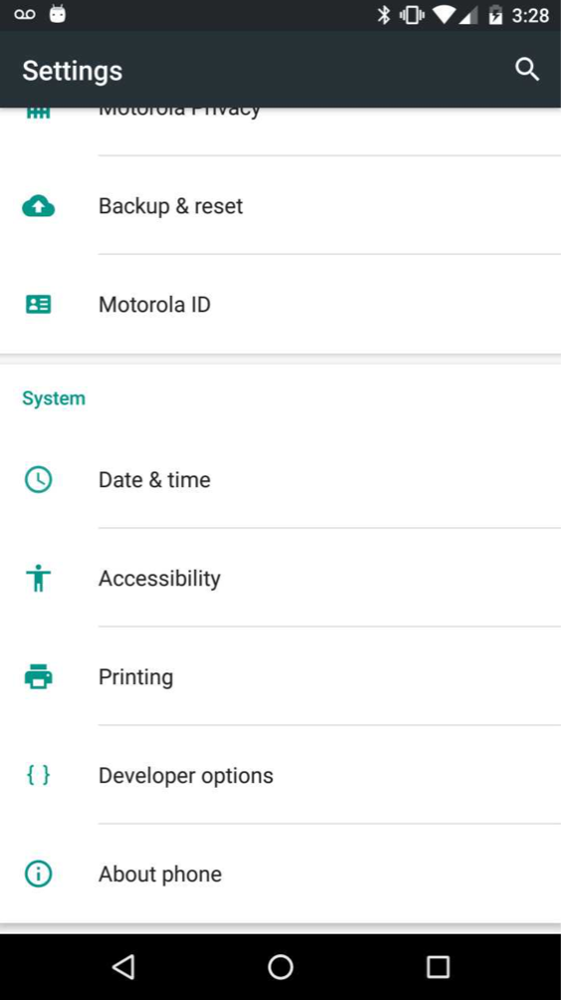

## Turning on USB Debugging on an Android Device

We need to enable **Developer Settings** on our phone. By default, these are *not* enabled. To do so, we should open the **Settings** application on our phone. Once opened, look for *About Phone* and open that menu.

Next, we should look for the **Build Number**. Tap it. You'll be given a notice that you're *almost* a developer! Keep tapping! Once you have, go back to the main **Settings** menu.

Scroll down your settings menu and you'll notice a brand new **{ } Developer options** menu. Open it!

We should enable Developer Options and USB Debugging. To do so, select:
- **Developer options** > toggle "on"
- Toggle USB Debugging "on"
- A popup will appear. Check "always allow for this computer" and "ok".

Congrats! You may now use your phone to debug and test apps with Android Studio!
